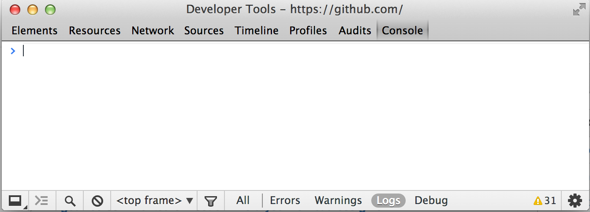
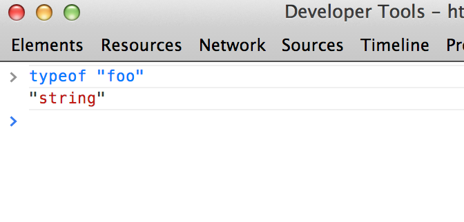
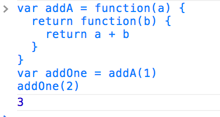

CS558 Supplementary Lecture 1: JavaScript
=========================================
We are experimenting with the structure of CS558 this semester.  Unlike in previous years, we are going to put a stronger emphasis on technical skills and implementation this semester.  In particular, one of the main goals of this course is to encourage student collaboration and to this end you will each be publishing open source software in the form of modules for node.js each week.  As the course progresses you will be able to use both your own modules and the modules that other students have written.  At the half way point in the course, we will switch into a project focused mode where all the modules written so far will be available for you to use in creating something yourself.

## Why use JavaScript and node.js?
The choice of JavaScript may seem somewhat unconventional, but after reviewing the other possibilities there are quite a few strong reasons to choose it:

* Easy to set up, low barrier to entry
* Simple distribution and demonstration, can use in a web page
* Fast performance, comparable to Java in most cases
* Good tools for collaboration and sharing code
* Most widely used programming language in the world

It is also maybe worth saying a bit about the other options that were considered, and the reasons why we ultimately decided not to use them:

* C/C++/Java: Very poor support for packages/modules.  Difficult to collaborate in and share code.
* Ruby: Strong package manager and easy set up, but very poor performance.  Extremely difficult to write performant algorithms and data structures.
* Python: Complicated and confusing to set up.  Distribution is extremely difficult.  Has multiple package managers, but all are much weaker than npm/gem.  Also performance is significantly worse than JavaScript.  (But does have better and more mature libraries for numerical computing).
* MATLAB: Not well suited for writing data structures and algorithms.
* Multiple languages/agnostic grading:  Difficult to collaborate, too much confusion.

The reason to use node.js is that adds support for modules and lets you run JavaScript programs from the terminal.  This makes testing more convenient and allows for the reuse and sharing of code.

# A quick introduction to JavaScript

## Quick start
I said earlier that JavaScript is the most ubiquitous programming language.  In fact, if you are reading this in a web browser you can start coding in JS right now and follow along with this tutorial.  To do this in Google Chrome just press Control+Shift+J  (or Command+Shift+J on a Mac) to open up Chrome's developer tools.  On Firefox you can do this using Control+Option+K.

Once open, click on the "Console" tab and you will get an interactive command prompt that looks like this:



Here you can type in JavaScript and execute it directly in your browser without even having to download or set anything up.

## Basic JavaScript

JavaScript is a dynamically typed object oriented language. This means that the types of variables are determined at run time.  For example, to declare a variable `a` and initialize it with an integer value of `1` we can write in JavaScript:

```javascript
var a = 1
```

This is unlike C++ or Java, where we don't need to declare the type of a variable when we define.  Instead the JavaScript run time tracks the type of `a` as the program executes.  In JavaScript, the type of a variable is always one of the following basic types:

* Numbers: Which are represented as 64-bit double precision floats internally.  Example: `1.0`
* Strings: That are arrays of characters, just like in Java.  Example: `"hello world"`
* Booleans: Logical true/false values.  Example: `true`
* Functions: Executable blocks of code. (more on this below)
* Objects: An unordered collection of name-value pairs (more on this below).
* Undefined: Which is the default type for uninitialized variables

And that's it!  You can figure out the type of a variable using the `typeof` operator.  For example,



Numbers, strings and booleans in JavaScript work basically like how you would expect and they support the same operators as in C++ or Java for the most part.  For example, you can add two numbers using the `+`, subtract them using `-`, use boolean short circuits with `&&` and `||`, and there is even a ternary operator `?`

```javascript
> var a = 1
undefined
> 1 + a
2
> a += 2
3
> 1 - a
-2
> (1 < 2) || (5 > 3)
true
> "foo" === "bar" ? "equal" : "not equal"
"not equal"
```

### Important: The `==` and `===` operators
The only slightly tricky thing about operators in JavaScript is the existence of the extra `===` comparison.  Both `==` and `===` are equality operators, but the main difference is that `===` does not do any type coercion.  For example,

```javascript
> "1" == 1
true
> "1" === 1
false
```

For this reason, it is generally preferred to use the `===` operator unless you explicitly want to do the type coercion.

## Statements
Just like C++ or Java, JavaScript is basically an imperative language (comapred to an expression based language like Lisp or Scheme).  Programs in JavaScript consist of sequences of commands that are executed sequentially.  In JavaScript, each statement is written on its own line.  For example,

```javascript
var x = 1
var y = 2
var z = x + y
```

You can also write multiple statements on the same line using semicolons (though it is maybe debatable how often this is a good idea):

```javascript
var x = 1
var y = 2
x = y + 1; y = x + 2;
```

You can also use standard structured programming constructs like for/while loops and if statements, and they work exactly the same as in any other C-like language.  For example,

```javascript
var j = 0
for(var i=0; i<10; ++i) {
  if(i % 2 === 0) {
    j += 1
  } else {
    j += 3
  }
}
```

## Functions
There are two basic ways to declare a function in JavaScript.

Anonymously:
```javascript
var f = function(a, b) { return a + b }
```

Named:
```javascript
function g(a, b) { return a + b }
```

In both cases, we can call the function just like we would in C/Java:

```javascript
> f(1, 2)
3
> g(3, 4)
7
```

However, unlike in C++ or Java, functions in JavaScript have lexical scoping.  This means that we can create functions that return functions.  For example,



## Objects

Objects in JavaScript are very different than in C++ or Java.  Unlike most other languages JavaScript objects are dynamic in the sense that they can have extra names and values added to them at run time.  There are two basic ways to create an object in JavaScript:


Using JSON syntax:
```javascript
var obj = {
  foo: 1,
  bar: "xyz",
  subobject: {
    z: false
  }
}
```

Or using the `new` keyword:

```javascript
function Point(x, y, z) {
  this.x = x
  this.y = y
  this.z = z
}

var p = new Point(1,2,3)
```

We can access the items within an object using either the square brackets `[]` or `.` syntax just like in Java:

```javascript
obj["foo"] = 1
obj.bar = false
```

Assigning to a name in an object creates a new value.  In this way, it is possible to use objects like a hash map.

You can iterate over all the names in an object using a for in loop:

```javascript
for(var name in obj) {
  console.log("key:", name, ", value:", obj[name])
}
```

### Arrays
Arrays are implemented as a special kind of object in JavaScript.  To declare an array, you use square brackets:

```javascript
var x = [1,2,3,4]
console.log(x[2])
```

You can use arrays in JavaScript kind of like B-trees.  It is possible to search and insert into them using the `splice` method.

## Builtins
There are also a number of built in functions that make programming JavaScript easier.  Here is a quick overview:

* `Math` The math object exposes a bunch of basic functions for doing arithmetic.  For example, `Math.sin`, `Math.sqrt`, etc.
* Strings have a number of builtins
* Arrays also have many useful built in functions
* The `Date` class lets you access timing and date specific functions
* There is also built in support for regular expressions, with a perl-like syntax


## Further topics
The above material pretty much covers all the basics of JavaScript.


