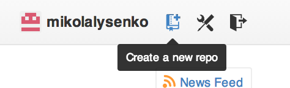
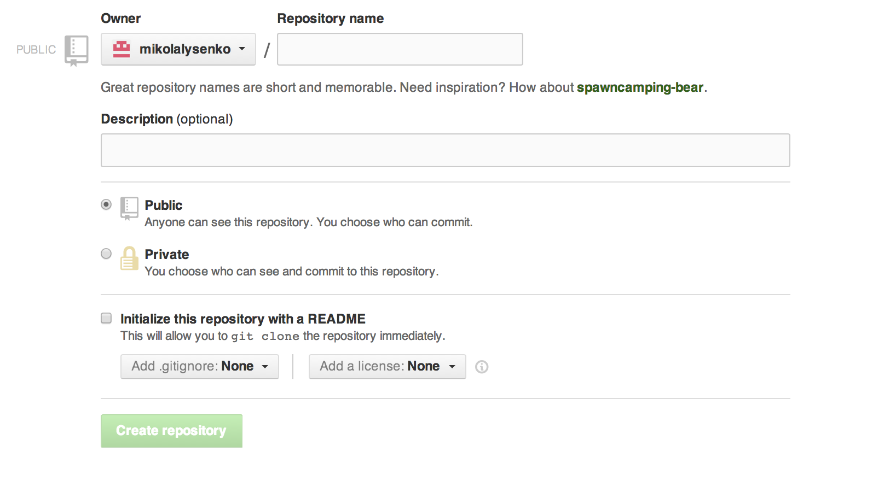
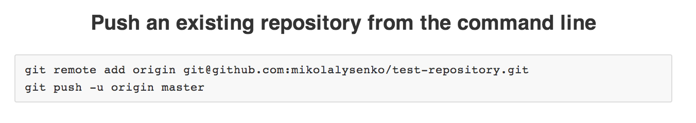

CS558 Technology Lecture 3: git
===============================
In the last two lectures we covered JavaScript and node.js, and we also went over the basics of how to publish a module on npm.  The goal of this lecture is to discuss how to collaborate on modules more efficiently and even more importantly to introduce git, which is a powerful distributed version control system.

Introduction to git
===================
Git is a tool that lets you maintain multiple distributed versions of a collection of files (for example, the source code for a large program).  It was invented by Linus Torvalds, who is the creator of Linux and is used in the day-to-day maintence of the Linux kernel.  Learning to use git is much easier than learning a new programming language or environment, but it does require a bit of patience to get started.

## Installing git
Installing git is a bit different depending on what system you are using.  On Linux or Mac, the easiest way to do this is to install git using your package manager.  For example, on Debian/Ubuntu you could do:

```sh
sudo apt-get install git
```

On OS X, you can install it using [homebrew](http://brew.sh/) or port.  For example,

```sh
sudo brew install git
```

You can also download and install git from git-scm.org directly:

* [http://git-scm.com/downloads](http://git-scm.com/downloads)

On Windows, the easiest solution might be to use github's windows installer.  You can find this here:

* [http://windows.github.com/](http://windows.github.com/)

## Basic git usage
Once you have git set up on your system, you can use it to create a new repository

To create a new git repository in some directory, you just type:  `git init`:

```
> git init
Initialized empty Git repository in /Users/mikolalysenko/GitHub/git-demo/.git/
```

This will create a folder in the current directory called `.git` that contains all the data necessary to track the history of the repository.  To add files to the repository, you type `git add filename`.  For example, here is how you can add a README to your git reposotory:

```
> touch README.md
> git add README.md
```

Once you've marked the files you want to track in the current revision, you can commit your changes using git commit

```
> git commit -m "initial project version"
[master (root-commit) 8eaaebf] initial project version
 0 files changed
 create mode 100644 README.md
```

To check out the status of your repository, you can type in `git status`

```
> git status
# On branch master
nothing to commit (working directory clean)
```

This tells you what files have outstanding changes that you need to commit.  If you want to make sure that some files are explicitly not tracked by git, you can create a file called .gitignore that will explicitly prevent you from accidentally adding them to version control.  This can be useful for example to prevent git from accidentally indexing your node_modules/ folder.  Here is example .gitignore file:

```
# A comment line
node_modules/*
npm-debug.log
```

You can also move/rename files using `git mv` and remove files using `git rm`.  For example,

```
> touch test.txt

> git add test.txt

> git commit -m "test.txt"

[master fec59f0] test.txt
 0 files changed
 create mode 100644 test.txt

> git mv test.txt foo.txt

> git commit -m "renamed test.txt to foo.txt"

[master 1b8fa77] renamed test.txt to foo.txt
 1 file changed, 0 insertions(+), 0 deletions(-)
 rename test.txt => foo.txt (100%)

> git rm foo.txt

> git commit -m "removed foo.txt"

[master dfdcb07] removed foo.txt
 0 files changed
 delete mode 100644 foo.txt
```

If you accidentally add a file that you didn't mean to, you can unmark it using the reset command.  Here is a simple example,

```
> touch test.txt
> git add test.txt
> git status
# On branch master
# Changes to be committed:
#   (use "git reset HEAD <file>..." to unstage)
#
#	new file:   test.txt
#
> git reset HEAD test.txt
> git status
# On branch master
# Untracked files:
#   (use "git add <file>..." to include in what will be committed)
#
#	test.txt
nothing added to commit but untracked files present (use "git add" to track)
```

## Branching
The above details are more-or-less standard in any competent version control system.  However what makes git unique is its powerful and simple distributed branching model.  At any time you can create a branch from the current HEAD commit by typing `git branch`:

```
> git branch test
> git branch
* master
  test
```

The main branch for a repository is called master, and there can be any number of subbranches.  Typing `git branch` with no arguments shows you a list of all the branches.  To switch the current branch you use the `checkout` command:

```
> git checkout test
Switched to branch 'test'
```

You can then use these branches as check points to move around.  For example, suppose that in the test branch we add some more files:

```
> touch testfile.txt
> git add testfile.txt
> git commit -m "added testfile"
[test 8312a30] added testfile
 0 files changed
 create mode 100644 testfile.txt
> ls
README.md	testfile.txt
```

We can then switch back to the master branch again using git checkout:

```
> git checkout master
Switched to branch 'master'
> ls
README.md	test.txt
```

And from here we could even make further changes:

```
> touch anotherfile.txt
> git add anotherfile.txt
> git commit -m "made another file"
[master cf08781] made another file
 0 files changed
 create mode 100644 anotherfile.txt
```

At this point the branch `test` and `master` have diverged.  Supposing that we want to apply the changes we made in `test` back to master, we can use the `merge` command to combine the two branches.  To merge the changes from `test` back into master, we can use the `merge` command:

```
> git merge test
Merge made by the 'recursive' strategy.
 0 files changed
 create mode 100644 testfile.txt
```

Then the results of making the test will be combined into a single branch in main.  If after doing this we don't want the old branch hanging around any more, we can remove it easily:

```
> git branch -d test
Deleted branch test (was 8312a30).
```

Sometimes when merging you will get merge conflicts.  When this happens, git will print out a message like, 

```
$ git merge test
Auto-merging test.txt
CONFLICT (content): Merge conflict in test.txt
Automatic merge failed; fix conflicts and then commit the result.
```

To verify this you can check the status using `git status` and manually go through and resolve the conflicts.  Once this is done, `git add` and `git commit` the changes to complete the merge.

### Undoing things
One of the most important aspects of branching is that this is how git also handles undoing and reverting actions.  Once you've made a commit in git, it is there for all time.  You can never permanently delete data from git, which greatly improves the robustness of the system.  Instead, if you want to go back to an earlier revision.  For example, if you want to go back to a previous version of your code, you can use the git checkout command again to revert to a previous using `git checkout` followed by the commit hash:


To make changes to this commit, you can make a branch and update it just as before.


Collaborating using github
==========================
Git by itself is just a tool for maintaing multiple versions of collections of files in a distributed system.  It is completely agnostic regarding how these repositories are distributed over the internet.  However, in node.js there is a preferred way to share repositories which is over github:

* [GitHub](http://github.com)

## Setting up github

To get started on github, first make an account.  As a student, you are entitled to a free small plan which allows you to have up to 5 private repositories.  To sign up for this account, go to the following URL:

* [Free academic accounts on GitHub](http://github.com/edu)

Once that is done, you will probably want to set up a shared RSA key so you don't have to keep typing your password each time you push something.  To do this, you should follow the instructions on the following website:

* [Generating SSH keys](https://help.github.com/articles/generating-ssh-keys)

## Basic usage
Once you have an account, it is pretty easy to create and share remote repositories.  To do this, you just click on the create new repository bytton in the upper right corner:



Once you do that, you will get a screen that looks something like this:



If you type in a name, and hit "Create repository" github will create a new empty remote repository for you.  You can now use this remote repository to back up one of your local git repositories online.  GitHub is pretty explicit in telling you how to do this.  If you look at the page, notice the following box,



Typing the first line into your repository tells git to add a remote host called "origin" to the repository:

```
> git remote add origin git@github.com:mikolalysenko/test-repository.git
```

The second line,

```
> git push -u origin master
```

Pushes your master branch to the remote repository called origin.  In general, the syntax:

```
> git push remote-repo local-branch
```

Tells git to make a copy of your local repository branch on the remote repository called remote-repo.

## Cloning, forking and patching

The main advantage to using github to manage your repositories is that it is much easier to make contributions to existing open source projects.  For example, if you want to copy an existing repository from github, you can clone it using the git-clone command:

```
> git clone git@github.com:mikolalysenko/test-repository.git
```

You can also make copies of repositories directly on github using the fork feature.  This lets you own your own copy of the repository so you can make modifications and test things out yourself.

Once you've made a change to a fork, you can also send a patch back upstream to the original using github's pull request feature.  The owner of the original repository can view the pull requests for their project, make comments and review the patch and ultimately accept or reject your changes.

## Other features
The primary of function of github is that it offers you a convenient and simple way to store git repositories remotely.  This makes it much easier to collaborate on projects and maintain backups of your work.  However, GitHub also has many other useful features that make management of open source projects much easier.  The following is a brief survey of some of the more useful parts of GitHub.

### Markdown
For documenting your projects, github supports the [markdown](http://daringfireball.net/projects/markdown/) document mark up lanaguage.  If you create a file called README.md in the root of your project, GitHub will by default render this file on the first page of your repository.  This can be helpful in explaining and documenting how your code works.  npm also supports markdown, and by default will display your github README on your npm page if you have specified it.

### Issue tracking, wikis and statistics
GitHub has a built in bug tracker and wiki.  You can use this to keep track of feature requests and bugs in your project, as well as open up issues on other projects.  The wiki is again built on top of markdown and can be used to maintain more detailed documentation for your project.  Finally, GitHub also has a detailed statistics tracking API which is useful for viewing the branch history and commits of your project.

### NPM integration
npm is also smart enough to be able to load packages from sources other than npm.  In particular, it understands git repositories and can load modules from a git repository url.  There is also strong integration with github, and you can use it to directly load a module by specifying the username/repository as a dependency.

References
==========
There are a large number of tutorials online that talk about how to use git in great detail.  One of the best of these is "Pro Git" which covers all the basics in great detail:

* [Pro Git](http://git-scm.com/book)

There are also a number of fun interactive tutorials to practice using git:

* [Learn git branching!](http://pcottle.github.io/learnGitBranching/)

The above reference is highly recommended and can be played as something like an interactive puzzle game.

Finally, if you want to know more about the GitHub service, you can read their extensive online documentation and help here:

* [https://help.github.com/](https://help.github.com/)
